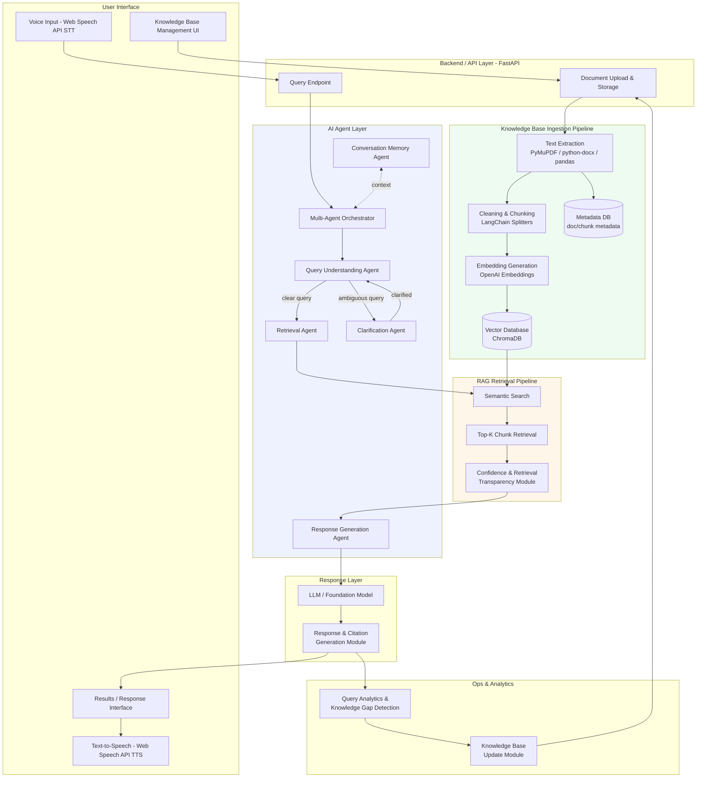

# M1.2 — System Architecture

## 1. Overview

This document describes the system architecture for the RAG-based multi-agent assistant, covering component layout, agent responsibilities, orchestration flow, and core data schemas. It builds directly on the concepts researched in M1.1 (`docs/research/rag-overview.md`).

---

## 2. Tech Stack

| Layer | Technology |
|---|---|
| Backend / API | FastAPI |
| PDF extraction | PyMuPDF |
| DOCX extraction | python-docx |
| CSV extraction | pandas |
| TXT extraction | Python built-in file I/O |
| Chunking | LangChain text splitters (`RecursiveCharacterTextSplitter`) |
| Embeddings | OpenAI Embeddings API (via `langchain-openai`) |
| Vector store | ChromaDB |
| LLM (generation) | OpenAI (via LangChain) |
| Voice I/O | Web Speech API (browser-native STT/TTS) |
| Orchestration | Custom multi-agent orchestrator (Python) |

---

## 3. Architecture Diagram



---

## 4. Agent Responsibilities

### Query Understanding Agent
- Parses the incoming user query (text or voice-transcribed).
- Classifies query type: factual, procedural, comparative, or unavailable-information (per M1.4 test categories).
- Detects ambiguity and decides whether to route to the Clarification Agent or straight to the Retrieval Agent.

### Retrieval Agent
- Embeds the query using the same embedding model used at ingestion time (consistency requirement, per M1.1 research).
- Queries ChromaDB for the top-K most similar chunks.
- Passes retrieved chunks, along with their metadata (source doc, chunk id, similarity score), to Response Generation.

### Clarification Agent
- Activated when Query Understanding flags a query as ambiguous or underspecified.
- Generates a targeted follow-up question to the user rather than guessing.
- Passes the clarified query back to the Query Understanding Agent.

### Response Generation Agent
- Constructs the grounded prompt (retrieved chunks + instructions not to hallucinate + conversation context).
- Invokes the LLM to generate the final answer strictly from provided context.
- Attaches citations back to source chunks/documents.
- Abstains ("I don't know") when retrieved chunks don't sufficiently answer the query.

### Conversation Memory Agent
- Maintains short-term conversation history/context across turns.
- Supplies relevant prior turns to Query Understanding and Response Generation so follow-up questions ("what about the second one?") resolve correctly.

### Multi-Agent Orchestrator
- Central coordinator that routes a query through the agent pipeline in order: Query Understanding → (Clarification, if needed) → Retrieval → Response Generation.
- Injects Conversation Memory context at each relevant step.
- Owns error handling/timeouts across agent calls.

---

## 5. Orchestration Flow

1. User submits a query (typed or via Web Speech API voice input).
2. Orchestrator invokes **Query Understanding Agent**, with conversation context from **Conversation Memory Agent**.
3. If ambiguous → **Clarification Agent** asks a follow-up; loop back to step 2 once resolved.
4. If clear → **Retrieval Agent** embeds the query and retrieves top-K chunks from ChromaDB.
5. **Response Generation Agent** builds the grounded prompt and calls the LLM.
6. Response, with citations and a confidence/retrieval-transparency indicator, is returned to the UI.
7. **Conversation Memory Agent** stores this turn for future context.
8. Response is optionally read aloud via Web Speech API TTS.
9. Query and retrieval outcome are logged to **Query Analytics & Knowledge Gap Detection** for M2+ improvement work.

---

## 6. Data Models / Schemas

### Document
```json
{
  "document_id": "uuid",
  "filename": "string",
  "file_type": "pdf | docx | txt | csv",
  "upload_timestamp": "datetime",
  "domain": "string",
  "status": "processing | indexed | failed"
}
```

### Chunk
```json
{
  "chunk_id": "uuid",
  "document_id": "uuid (FK)",
  "chunk_index": "int",
  "text": "string",
  "token_count": "int",
  "overlap_prev": "int"
}
```

### Embedding
```json
{
  "chunk_id": "uuid (FK)",
  "vector": "float[]",
  "embedding_model": "string",
  "dimensions": "int"
}
```

### Query
```json
{
  "query_id": "uuid",
  "session_id": "uuid",
  "raw_text": "string",
  "query_type": "factual | procedural | comparative | unavailable",
  "timestamp": "datetime"
}
```

### Retrieval Result
```json
{
  "query_id": "uuid (FK)",
  "chunk_id": "uuid (FK)",
  "similarity_score": "float",
  "rank": "int"
}
```

### Response
```json
{
  "query_id": "uuid (FK)",
  "answer_text": "string",
  "citations": ["chunk_id", "..."],
  "confidence_score": "float",
  "abstained": "boolean"
}
```

---

## 7. Data Flow (End-to-End)

```
Document Upload
   → Text Extraction (PyMuPDF / python-docx / pandas / built-in read)
   → Cleaning & Normalization
   → Chunking (LangChain RecursiveCharacterTextSplitter, with overlap)
   → Embedding Generation (OpenAI Embeddings)
   → Vector Store Indexing (ChromaDB, + metadata)

User Query
   → Query Understanding Agent (classify + check clarity)
   → [Clarification Agent, if needed]
   → Retrieval Agent (embed query → semantic search → top-K chunks)
   → Response Generation Agent (grounded prompt → LLM → cited answer)
   → Results Interface (+ optional TTS)
   → Query Analytics (logged for gap detection / M2 improvements)
```

---

## 8. Notes for Next Milestones

- This architecture will be updated as M1.3 (ingestion module) and M1.4 (retrieval validation) surface implementation-level adjustments.
- Confidence & Retrieval Transparency Module is scoped here structurally; scoring logic will be defined during M1.4 evaluation work.
